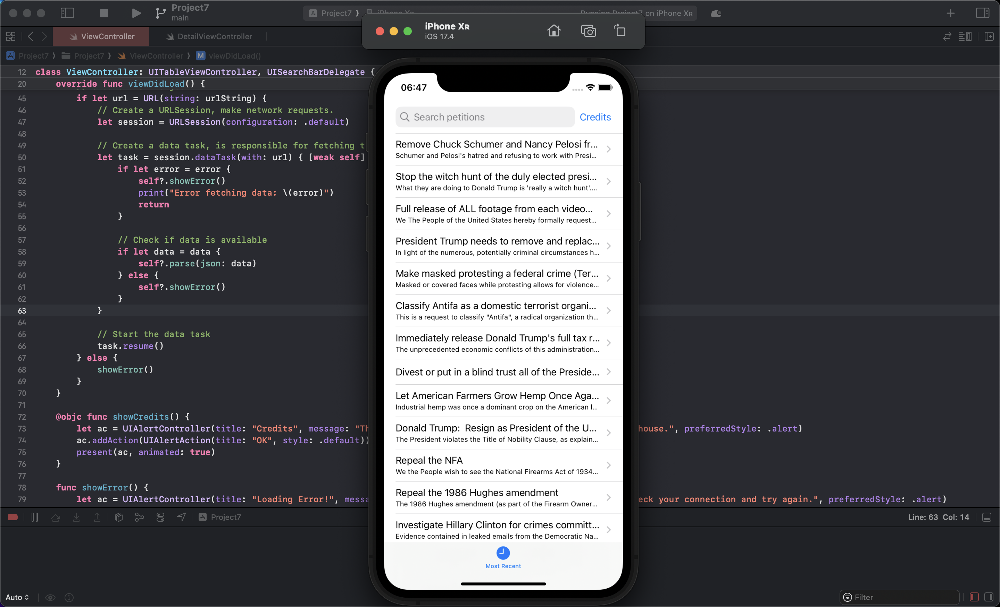
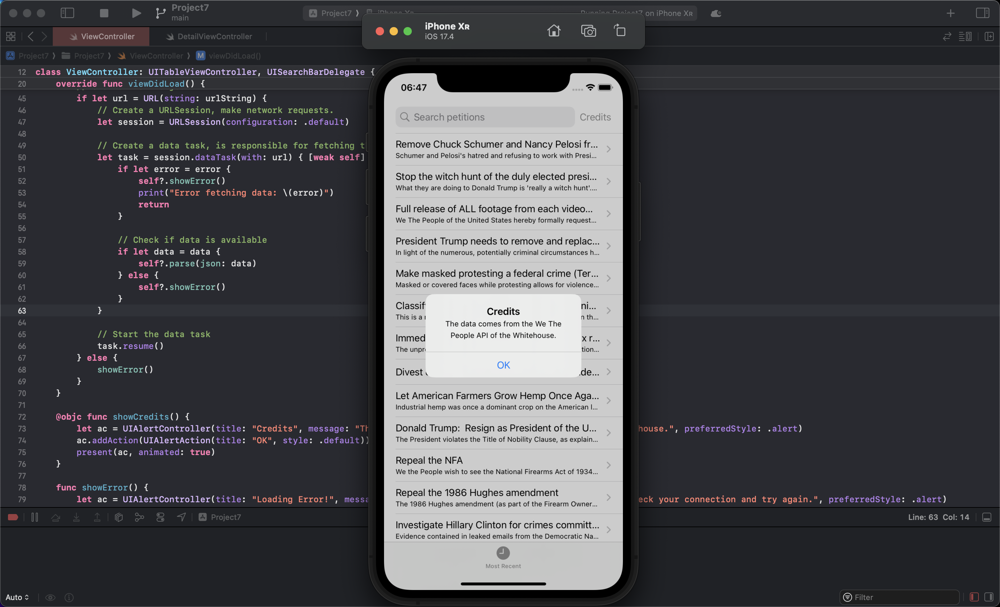
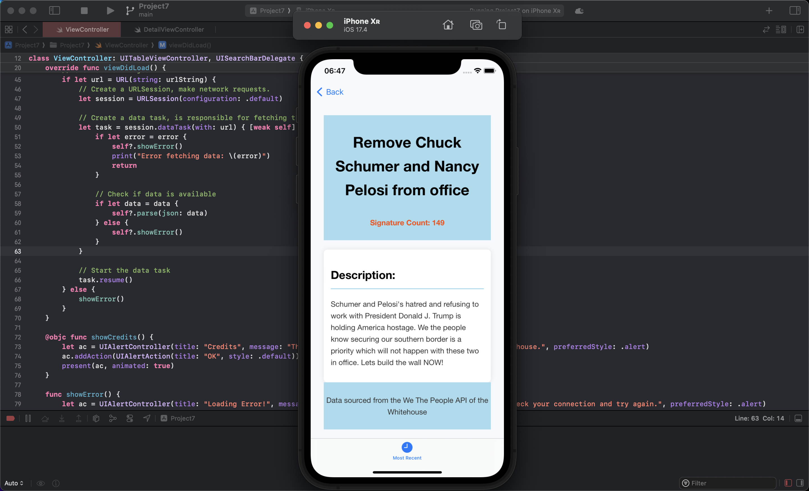
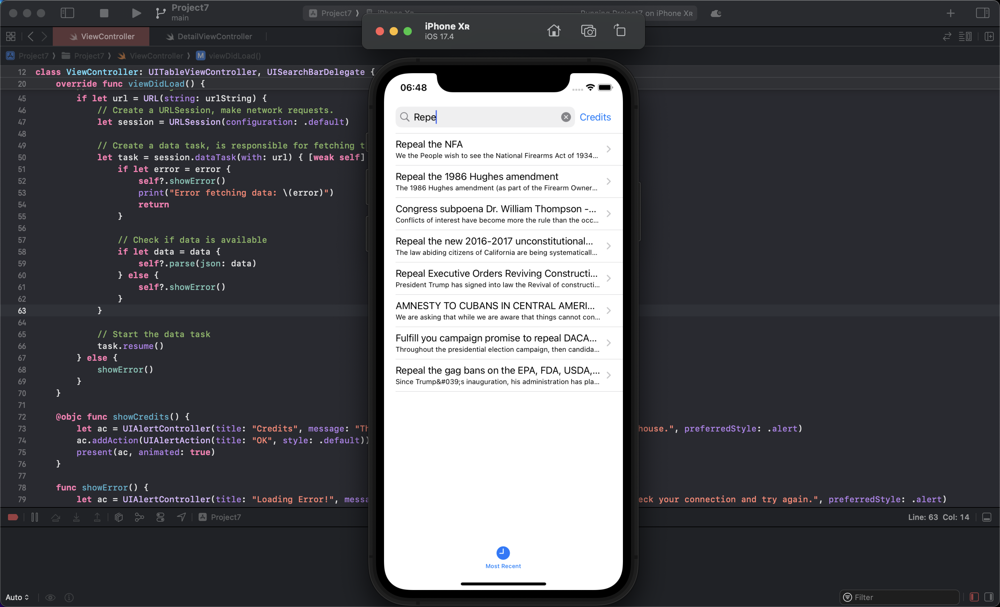

# UIKit

# Challenge

## One of the best ways to learn is to write your own code as often as possible, so here are three ways you should try extending this app to make sure you fully understand what’s going on:

## Add a Credits button to the top-right corner using UIBarButtonItem. When this is tapped, show an alert telling users the data comes from the We The People API of the Whitehouse.
## Let users filter the petitions they see. This involves creating a second array of filtered items that contains only petitions matching a string the user entered. Use a UIAlertController with a text field to let them enter that string. This is a tough one, so I’ve included some hints below if you get stuck.
## Experiment with the HTML – this isn’t a HTML or CSS tutorial, but you can find lots of resources online to give you enough knowledge to tinker with the layout a little.

### Challenge is done:

# Day 34,35

